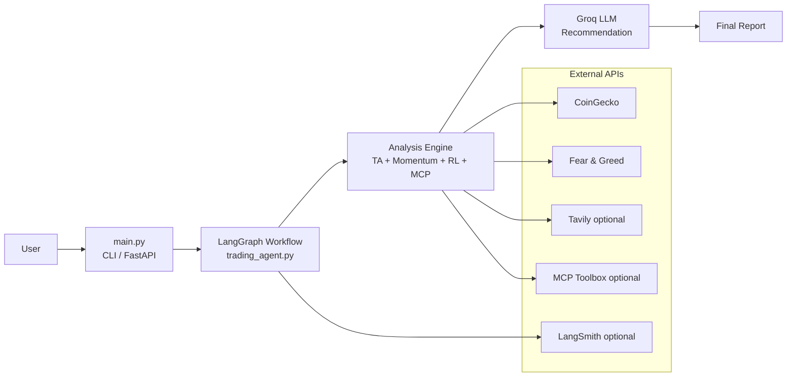
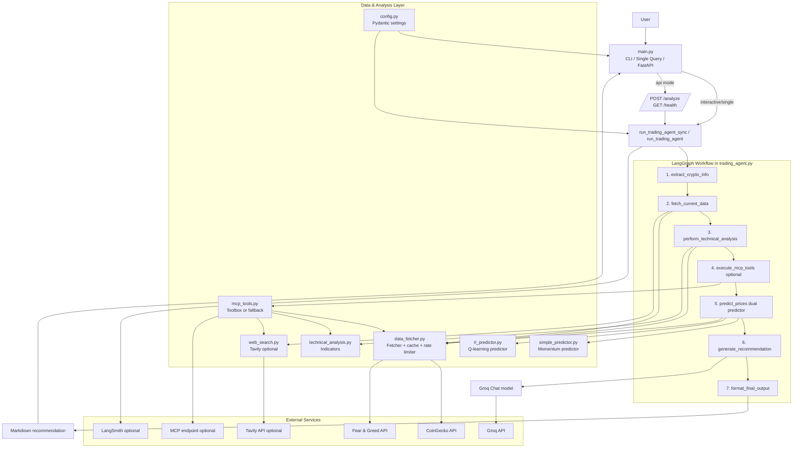

# Dex Agent Architecture

This document explains how the Crypto Trading Agent is structured, how requests move through the system, and how each module contributes to the final recommendation.

## High-Level Overview

The application has three user-facing entry paths:

- Interactive CLI mode
- Single-query CLI mode
- FastAPI server mode

All of them route into the same LangGraph workflow implemented in `trading_agent.py`.

## Runtime Flow

1. User submits a query in CLI or API.
2. `main.py` calls `run_trading_agent_sync` or `run_trading_agent`.
3. LangGraph executes workflow nodes in sequence:
   - extract user intent and symbol
   - fetch market data
   - run technical analysis
   - run optional MCP tools
   - run dual prediction (Momentum + RL)
   - generate LLM recommendation
   - format final markdown output
4. Final recommendation is returned to CLI or API response.

## Block-Wise Detailed Architecture

### Block 1: User Interaction & Entry Interface

**Primary modules:** `main.py`

**Responsibilities:**

- Accepts user requests from:
  - Interactive terminal chat mode
  - Single command-line query mode
  - FastAPI endpoint (`POST /analyze`)
- Normalizes request text and calls trading workflow.
- Returns formatted recommendation output to user.
- Logs each request outcome (success/failure, latency, excerpt) through local query logger.

**Inputs:** natural language investment query (+ optional API fields)

**Outputs:** formatted recommendation string / API response

---

### Block 2: Request Logging & Audit Storage

**Primary modules:** `query_logger.py`, `config.py`

**Responsibilities:**

- Stores real-time query events in SQLite.
- Captures metadata:
  - timestamp, mode, query text
  - symbol/amount/risk/horizon (if available)
  - success flag, latency, error message
  - short response excerpt

**Storage:** `logs/query_logs.db` (table: `query_logs`)

**Purpose:** auditability, debugging, analytics on user interaction quality.

---

### Block 3: Workflow Orchestrator (State Machine)

**Primary modules:** `trading_agent.py`, `langgraph.json`

**Responsibilities:**

- Defines `TradingAgentState`.
- Executes deterministic node sequence:
  1. `extract_info`
  2. `fetch_data`
  3. `technical_analysis`
  4. `mcp_tools` (optional)
  5. `predict_prices`
  6. `generate_recommendation`
  7. `format_output`
- Handles fallback behavior when data/analysis steps fail.

**Purpose:** central coordination and reliable step-by-step execution.

---

### Block 4: Market Data Acquisition Layer

**Primary modules:** `data_fetcher.py`, `web_search.py`

**Responsibilities:**

- Fetches market and historical data from CoinGecko.
- Fetches Fear & Greed index from Alternative.me.
- Optionally fetches web news/sentiment via Tavily.
- Applies request throttling and in-memory cache for API efficiency.

**Core data fields used across pipeline:**

- Price: current price, 24h high/low, percentage changes
- Volume: 24h volume and trend context
- Historical OHLC candles for indicators/backtesting
- Sentiment context (Fear & Greed + optional news)

---

### Block 5: Technical Analysis Engine

**Primary modules:** `technical_analysis.py`

**Responsibilities:**

- Computes indicator set used by recommendation + RL feature context:
  - Price action trend (1d/7d/30d)
  - RSI
  - Volume profile summary
  - EMA stack (9/21/50/200)
  - Support/Resistance levels
  - Bollinger Bands
  - Liquidity zones

**Output:** structured analysis dictionary passed downstream.

---

### Block 6: Dual Prediction Engine

**Primary modules:** `simple_predictor.py`, `rl_predictor.py`, `trading_agent.py`

**Responsibilities:**

- Runs two independent predictors:
  - Momentum-based projection
  - RL Q-learning-based projection
- Combines both into final forecast and final signal.
- Produces confidence bands and short/medium/long expected return values.

**Signal fusion logic:** weighted scoring over `strong_sell/sell/hold/buy/strong_buy`.

---

### Block 7: Prediction Memory Store (New)

**Primary modules:** `prediction_feedback.py`, `config.py`

**Responsibilities:**

- Stores each generated prediction for delayed validation.
- Saved record includes:
  - symbol, entry price, predicted horizon price
  - signal, confidence, horizon days
  - RL state/action metadata for later learning update
  - due timestamp when prediction becomes evaluable

**Storage:** `logs/prediction_feedback.json`

**Purpose:** creates memory for closed-loop learning from real outcomes.

---

### Block 8: Time-Delayed Feedback & Self-Improvement Loop (New)

**Primary modules:** `prediction_feedback.py`, `rl_predictor.py`, `trading_agent.py`

**Responsibilities:**

- At every agent run, checks due prediction records.
- Fetches actual current market price when horizon is reached.
- Computes realized return and correctness (buy/sell/hold band logic).
- Converts outcome into reward and updates RL Q-table (`update_from_outcome`).
- Saves updated RL model weights.

**Model persistence:** `models/rl_q_table.json`

**Purpose:** continuous online refinement based on real market outcomes.

---

### Block 9: Recommendation Generation (LLM Layer)

**Primary modules:** `trading_agent.py`, `config.py`, `langsmith.json`

**Responsibilities:**

- Uses Groq-hosted LLM via LangChain OpenAI-compatible client.
- Synthesizes all upstream context (market, TA, predictors, optional MCP data).
- Generates actionable strategy text:
  - direction (buy/sell/hold)
  - entry approach
  - risk controls and horizon framing

**Observability:** optional tracing through LangSmith.

---

### Block 10: Optional Tool Enrichment Layer (MCP)

**Primary modules:** `mcp_tools.py`

**Responsibilities:**

- Adds optional advanced tools:
  - risk metrics
  - support/resistance refinement
  - correlation
  - volume profile
  - news checks
- Uses Toolbox client if available, fallback tools otherwise.

**Purpose:** enrich recommendation depth when external tools are enabled.

---

### Block 11: Evaluation & Quality Validation Layer

**Primary modules:**

- `evaluate_rl_model.py`
- `completeevaluation.py`
- `strategy_accuracy_evaluation.py`

**Responsibilities:**

- RL-specific walk-forward performance checks.
- End-to-end output quality scoring for generated recommendations.
- Strategy directional-accuracy backtest over historical windows.

**Outputs:** reports under `reports/` and updated RL model artifacts.

## Component Responsibilities

### 1) Interface Layer

- `main.py`
  - CLI interactive loop and single-shot query execution
  - FastAPI server (`/analyze`, `/health`)
  - Rich console formatting for terminal output

### 2) Orchestration Layer

- `trading_agent.py`
  - Defines `TradingAgentState`
  - Builds and compiles LangGraph workflow
  - Coordinates every analysis step
  - Calls Groq model through `ChatOpenAI`

### 3) Data Layer

- `data_fetcher.py`
  - CoinGecko market data
  - Fear & Greed index retrieval
  - In-memory caching
  - Request rate limiting

### 4) Analysis & Prediction Layer

- `technical_analysis.py`
  - RSI, EMA, Bollinger Bands, support/resistance, volume, liquidity
- `simple_predictor.py`
  - Momentum-based forecast
- `rl_predictor.py`
  - Q-learning style signal and price forecast
- Combined predictor logic lives in `trading_agent.py` (weighted fusion).

### 5) Enrichment Layer (Optional)

- `mcp_tools.py`
  - MCP Toolbox integration (or fallback local tools)
  - Adds risk metrics, correlation, support/resistance, volume profile, news checks
- `web_search.py`
  - Tavily-based crypto news/sentiment enrichment

### 6) Configuration & Observability

- `config.py`
  - Loads settings from `.env`
  - Controls model parameters and API keys
- `langgraph.json`
  - Graph registration for LangGraph dev
- `langsmith.json`
  - LangSmith tracing/model configuration wiring

## External Dependencies

- Groq API (LLM inference)
- CoinGecko API (market data)
- Alternative.me Fear & Greed API
- Tavily API (optional web/news sentiment)
- MCP Toolbox endpoint (optional)
- LangSmith (optional tracing)

## Architecture Diagram (Quick View)



## Architecture Diagram



## Full System Diagram (with Feedback Loop)

```mermaid
flowchart LR
    U[User]
    CLI[CLI / API Interface\nmain.py]
    QLOG[Query Logger\nquery_logger.py\nlogs/query_logs.db]

    subgraph ORCH[Workflow Orchestrator - trading_agent.py]
      W0[Process due feedback records]
      W1[Extract query info]
      W2[Fetch data]
      W3[Technical analysis]
      W4[MCP optional]
      W5[Dual prediction\nMomentum + RL]
      W6[Store prediction record]
      W7[LLM recommendation]
      W8[Format output]
    end

    subgraph DATA[Data & Intelligence]
      DF[data_fetcher.py]
      TA[technical_analysis.py]
      SP[simple_predictor.py]
      RL[rl_predictor.py\nQ-table model]
      PF[prediction_feedback.py\nlogs/prediction_feedback.json]
      MODEL[models/rl_q_table.json]
      WS[web_search.py]
      MCP[mcp_tools.py]
    end

    subgraph EXT[External Services]
      CG[CoinGecko]
      FG[Fear & Greed]
      TV[Tavily optional]
      GX[Groq LLM]
      LS[LangSmith optional]
      MT[MCP Toolbox optional]
    end

    subgraph EVAL[Evaluation Layer]
      ERL[evaluate_rl_model.py]
      E2E[completeevaluation.py]
      ESTRAT[strategy_accuracy_evaluation.py]
      RPT[reports/*.json|md]
    end

    U --> CLI
    CLI --> QLOG
    CLI --> W0 --> W1 --> W2 --> W3 --> W4 --> W5 --> W6 --> W7 --> W8 --> CLI

    W2 --> DF
    W2 --> WS
    W3 --> TA
    W5 --> SP
    W5 --> RL
    W6 --> PF
    W0 --> PF
    W0 --> RL
    RL --> MODEL

    DF --> CG
    DF --> FG
    WS --> TV
    W4 --> MCP --> MT
    W7 --> GX
    W7 --> LS

    ERL --> RL
    E2E --> CLI
    ESTRAT --> RL
    ERL --> RPT
    E2E --> RPT
    ESTRAT --> RPT
```

## Box-Wise Flowchart (Element-by-Element)

```mermaid
flowchart TD
  A1[User Query\nCLI / API]
  A2[main.py\nInput Handling]
  A3[query_logger.py\nStore Request Log\nlogs/query_logs.db]

  B1[Feedback Processor\nprediction_feedback.process_due_predictions]
  B2[Load Pending Predictions\nlogs/prediction_feedback.json]
  B3[Fetch Actual Price\ndata_fetcher.get_coin_details]
  B4[Compute Correctness\nBuy/Sell/Hold vs Real Return]
  B5[RL Update\nrl_predictor.update_from_outcome]
  B6[Save RL Model\nmodels/rl_q_table.json]

  C1[LangGraph Start\ntrading_agent.create_trading_agent]
  C2[Node 1: extract_info]
  C3[Node 2: fetch_data]
  C4[Node 3: technical_analysis]
  C5[Node 4: mcp_tools (optional)]
  C6[Node 5: predict_prices]
  C7[Node 6: generate_recommendation]
  C8[Node 7: format_output]

  D1[data_fetcher.py\nCoinGecko + FearGreed]
  D2[technical_analysis.py\nRSI EMA BB S/R Volume]
  D3[simple_predictor.py\nMomentum Predictor]
  D4[rl_predictor.py\nQ-Learning Predictor]
  D5[prediction_feedback.store_prediction\nSave New Prediction]

  E1[Groq LLM\nRecommendation Synthesis]
  E2[Final Output\nStrategy Report]

  X1[CoinGecko API]
  X2[Alternative.me FearGreed API]
  X3[Tavily API optional]
  X4[MCP Toolbox optional]
  X5[LangSmith optional]

  A1 --> A2 --> A3
  A2 --> B1
  B1 --> B2 --> B3 --> B4 --> B5 --> B6

  A2 --> C1 --> C2 --> C3 --> C4 --> C5 --> C6 --> C7 --> C8 --> E2

  C3 --> D1
  C4 --> D2
  C6 --> D3
  C6 --> D4
  C6 --> D5
  C7 --> E1

  D1 --> X1
  D1 --> X2
  C3 --> X3
  C5 --> X4
  C1 --> X5
```

## Notes

- The workflow is sequential and deterministic by design.
- MCP and Tavily paths are optional and controlled by configuration.
- Failures in data/tool steps use fallbacks so the agent can still return a recommendation.