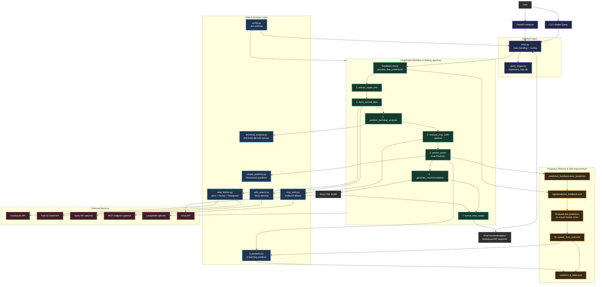

# Project Flowchart (Styled)

```mermaid
flowchart TB

  %% ===== TOP INPUTS =====
  USER[User]
  CLI[CLI / Single Query]
  APIENTRY[FastAPI /analyze]

  USER --> CLI
  USER --> APIENTRY

  %% ===== INTERFACE LAYER =====
  subgraph L1[Interface Layer]
    MAIN[main.py\nInput handling + routing]
    QLOG[query_logger.py\nlogs/query_logs.db]
  end

  CLI --> MAIN
  APIENTRY --> MAIN
  MAIN --> QLOG

  %% ===== ORCHESTRATION LAYER =====
  subgraph L2[LangGraph Workflow in trading_agent.py]
    N0[Feedback check\nprocess_due_predictions]
    N1[1. extract_crypto_info]
    N2[2. fetch_current_data]
    N3[3. perform_technical_analysis]
    N4[4. execute_mcp_tools\noptional]
    N5[5. predict_prices\nDual Predictor]
    N6[6. generate_recommendation]
    N7[7. format_final_output]

    N0 --> N1 --> N2 --> N3 --> N4 --> N5 --> N6 --> N7
  end

  MAIN --> N0

  %% ===== DATA + MODEL LAYER =====
  subgraph L3[Data & Analysis Layer]
    DF[data_fetcher.py\nprice + history + fear/greed]
    TA[technical_analysis.py\nRSI EMA BB S/R Volume]
    MOM[simple_predictor.py\nMomentum predictor]
    RL[rl_predictor.py\nQ-learning predictor]
    MCP[mcp_tools.py\nToolbox/Fallback]
    WS[web_search.py\nTavily optional]
    CFG[config.py\n.env settings]
  end

  N2 --> DF
  N2 --> WS
  N3 --> TA
  N4 --> MCP
  N5 --> MOM
  N5 --> RL
  CFG --> MAIN
  CFG --> L2

  %% ===== FEEDBACK MEMORY =====
  subgraph L4[Prediction Memory & Self-Improvement]
    STORE[prediction_feedback.store_prediction]
    PFILE[logs/prediction_feedback.json]
    EVAL[Evaluate due prediction\nvs actual market move]
    UPDATE[RL update_from_outcome]
    MODEL[models/rl_q_table.json]
  end

  N5 --> STORE --> PFILE
  N0 --> PFILE --> EVAL --> UPDATE --> MODEL
  UPDATE --> RL
  RL --> MODEL

  %% ===== LLM + OUTPUT =====
  LLM[Groq Chat model]
  OUT[Final recommendation\nMarkdown/API response]

  N6 --> LLM --> N7 --> OUT
  OUT --> MAIN

  %% ===== EXTERNAL SERVICES =====
  subgraph EXT[External Services]
    CG[CoinGecko API]
    FG[Fear & Greed API]
    TV[Tavily API optional]
    MT[MCP endpoint optional]
    LS[LangSmith optional]
    GQ[Groq API]
  end

  DF --> CG
  DF --> FG
  WS --> TV
  MCP --> MT
  LLM --> GQ
  L2 --> LS

  %% ===== STYLE =====
  classDef interface fill:#1f2a44,stroke:#8a6bff,color:#ffffff,stroke-width:2px;
  classDef workflow fill:#173a2f,stroke:#58d68d,color:#ffffff,stroke-width:2px;
  classDef data fill:#1f3552,stroke:#5dade2,color:#ffffff,stroke-width:2px;
  classDef feedback fill:#3a2a12,stroke:#f5b041,color:#ffffff,stroke-width:2px;
  classDef ext fill:#3f1f2a,stroke:#f1948a,color:#ffffff,stroke-width:2px;
  classDef output fill:#2f2f2f,stroke:#fdfefe,color:#ffffff,stroke-width:2px;

  class MAIN,QLOG,CLI,APIENTRY interface;
  class N0,N1,N2,N3,N4,N5,N6,N7 workflow;
  class DF,TA,MOM,RL,MCP,WS,CFG data;
  class STORE,PFILE,EVAL,UPDATE,MODEL feedback;
  class CG,FG,TV,MT,LS,GQ ext;
  class USER,OUT,LLM output;
```
